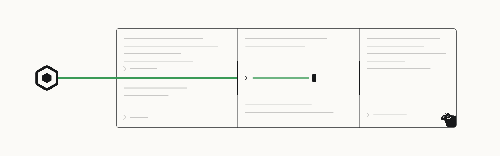

<p>
  <a href="https://openscout.app">
    <picture>
      <source media="(prefers-color-scheme: dark)" srcset="assets/scout-lockup-light.svg" />
      
    </picture>
  </a>
</p>

# Scout for herdr

Ask your Scout agents from any [herdr](https://herdr.dev) pane, send a selection to one, and keep the Scout feed beside your work.

[Install](#install) · [First ask](#first-ask) · [OpenScout](https://openscout.app) · [All integrations](https://github.com/oscout)

<!-- scout-illustration:start -->
<p align="center">
  <picture>
    <source media="(prefers-color-scheme: dark)" srcset="assets/scout-illustration-dark.svg" />
    
  </picture>
</p>
<p align="center"><em>Ask from a terminal pane and keep the Scout feed beside your work.</em></p>
<!-- scout-illustration:end -->

## Install

```bash
herdr plugin install oscout/herdr-scout
```

Requires herdr 0.9.0+, [Bun](https://bun.sh), and Scout itself:

```bash
bun add -g @openscout/scout
scout setup
```

Set `SCOUT_BIN` to point the plugin at a different `scout` binary.

## First ask

Open herdr's command palette and run **Scout: ask an agent**. Leave the target
blank and the ask routes to the agent for the focused pane's project.

## What it adds

- **Scout: ask an agent**: a popup that asks an agent. Leave the target blank
  and the ask routes to the agent for the focused pane's project.
- **Scout: ask about the selection**: the same popup, with the selected
  terminal text attached as a fenced block under your question.
- **Scout: open the feed**: a split that streams broker messages
  (`scout watch --since 30m`).

Every action goes through the `scout` CLI, so the plugin carries no broker code
of its own.

## Keybindings

Actions show up in herdr's command palette. To bind one, add it to your herdr
config, for example:

```toml
[[keys.command]]
key = "prefix+a"
type = "plugin_action"
command = "openscout.scout.ask"
description = "ask a Scout agent"

[[keys.command]]
key = "prefix+f"
type = "plugin_action"
command = "openscout.scout.feed"
description = "open the Scout feed"
```

## Develop

```bash
bun test
```

## License

Apache-2.0
